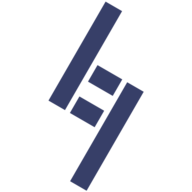

<!-- Improved compatibility of back to top link: See: https://github.com/othneildrew/Best-README-Template/pull/73 -->

<a name="readme-top"></a>

<!--
*** Thanks for checking out the Best-README-Template. If you have a suggestion
*** that would make this better, please fork the repo and create a pull request
*** or simply open an issue with the tag "enhancement".
*** Don't forget to give the project a star!
*** Thanks again! Now go create something AMAZING! :D
-->

<!-- PROJECT SHIELDS -->
<!--
*** I'm using markdown "reference style" links for readability.
*** Reference links are enclosed in brackets [ ] instead of parentheses ( ).
*** See the bottom of this document for the declaration of the reference variables
*** for contributors-url, forks-url, etc. This is an optional, concise syntax you may use.
*** https://www.markdownguide.org/basic-syntax/#reference-style-links
-->

[![Contributors][contributors-shield]][contributors-url]
[![Forks][forks-shield]][forks-url]
[![Stargazers][stars-shield]][stars-url]
[![Issues][issues-shield]][issues-url]
[![MIT License][license-shield]][license-url]
[![LinkedIn][linkedin-shield]][linkedin-url]

<!-- PROJECT LOGO -->
<br />
<div align="center">
  <a href="https://github.com/Dantalian5/product-feedback-app">
    
  </a>

<h3 align="center">Frontend Feedback</h3>

  <p align="center">
    Product feedback webapp. This application is intended to allow users to interact with their own and others’ feedback and proposals. It also allows the addition of comments and replies. This is a Full Stack project courtesy of FrontendMentor.io.
    <br />
    <a href="https://github.com/Dantalian5/product-feedback-app"><strong>Explore the docs »</strong></a>
    <br />
    <br />
    <a href="https://github.com/Dantalian5/product-feedback-app">View Demo</a>
    ·
    <a href="https://github.com/Dantalian5/product-feedback-app/issues">Report Bug</a>
    ·
    <a href="https://github.com/Dantalian5/product-feedback-app/issues">Request Feature</a>
  </p>
</div>

<!-- TABLE OF CONTENTS -->
<details>
  <summary>Table of Contents</summary>
  <ol>
    <li>
      <a href="#about-the-project">About The Project</a>
      <ul>
        <li><a href="#built-with">Built With</a></li>
      </ul>
    </li>
    <li>
      <a href="#getting-started">Getting Started</a>
      <ul>
        <li><a href="#installation">Installation</a></li>
      </ul>
    </li>
    <li><a href="#usage">Usage</a></li>
    <li><a href="#roadmap">Roadmap</a></li>
    <li><a href="#contributing">Contributing</a></li>
    <li><a href="#license">License</a></li>
    <li><a href="#contact">Contact</a></li>
    <li><a href="#acknowledgments">Acknowledgments</a></li>
  </ol>
</details>

<!-- ABOUT THE PROJECT -->

## About The Project

[![Product Name Screen Shot][product-screenshot]](https://example.com)

This project (proposed by frontendmentor.io) is based on an application that allows users to interact with a feedback and proposal dashboard for a specific product. Users can create, edit, and delete feedback, as well as comment and reply to feedback from other users, and vote on proposals. The original idea was not designed for a multi-user system, so adjustments were made to accommodate this. However, it does not include moderation of interactions or role changes in feedback, which should be handled through an administration system. Given the project’s purely demonstrative and educational nature, certain aspects that would be considered in a real project of this type are not addressed. The project structures a full stack application but uses Next.js server functions, eliminating the need for a separate API for database interactions. Authentication is handled using credentials only for illustrative purposes, though it can be improved by implementing multiple authentication systems.

<p align="right">(<a href="#readme-top">back to top</a>)</p>

### Built With

- Next.js
- Tailwind CSS
- Typescript
- PostgreSQL
- Next-Auth

<p align="right">(<a href="#readme-top">back to top</a>)</p>

<!-- GETTING STARTED -->

## Getting Started

To get a local copy up and running follow these simple example steps.

### Installation

1. Clone the repo
   ```sh
   git clone https://github.com/Dantalian5/product-feedback-app.git
   ```
2. Install NPM packages
   ```sh
   npm install
   ```
3. Configure your own environment variables & databases

<p align="right">(<a href="#readme-top">back to top</a>)</p>

<!-- USAGE EXAMPLES -->

## Usage

Use this space to show useful examples of how a project can be used. Additional screenshots, code examples and demos work well in this space. You may also link to more resources.

<p align="right">(<a href="#readme-top">back to top</a>)</p>

<!-- ROADMAP -->

## Roadmap

The users should be able to:

- [x] Create, read, update, and delete product feedback requests.
- [x] Receive form validations when trying to create/edit feedback requests.
- [x] Sort suggestions by most/least upvotes and most/least comments.
- [x] Filter suggestions by category.
- [x] Add comments and replies to a product feedback request.
- [x] Upvote product feedback requests.
- [x] View the optimal layout for the app depending on their device's screen size.
- [x] See hover states for all interactive elements on the page.

Full-Stack project additions

- [x] Use a database (PostgreSQL) to store product feedback requests & comments.
- [ ] Use the Next-Auth library to authenticate users.
- [x] Use the `zod` library to validate user input.
- [x] Implement unitary testing on critical components.
- [ ] Implement e2e testing.

Deployment & CI/CD:

- [ ] Deploy to Vercel
- [ ] Create a GitHub Action to test and create a docker image of the project

See the [open issues](https://github.com/Dantalian5/product-feedback-app/issues) for a full list of proposed features (and known issues).

<p align="right">(<a href="#readme-top">back to top</a>)</p>

<!-- CONTRIBUTING -->

## Contributing

Contributions are what make the open source community such an amazing place to learn, inspire, and create. Any contributions you make are **greatly appreciated**.

If you have a suggestion that would make this better, please fork the repo and create a pull request. You can also simply open an issue with the tag "enhancement".
Don't forget to give the project a star! Thanks again!

1. Fork the Project
2. Create your Feature Branch (`git checkout -b feature/AmazingFeature`)
3. Commit your Changes (`git commit -m 'Add some AmazingFeature'`)
4. Push to the Branch (`git push origin feature/AmazingFeature`)
5. Open a Pull Request

<p align="right">(<a href="#readme-top">back to top</a>)</p>

<!-- LICENSE -->

## License

Distributed under the MIT License. See `LICENSE` for more information.

<p align="right">(<a href="#readme-top">back to top</a>)</p>

<!-- CONTACT -->

## Contact

- Website - [Marcos Valenzuela](https://marcosvalenzuela.netlify.app)
- Frontend Mentor - [@Dantalian5](https://www.frontendmentor.io/profile/Dantalian5)
- Github - [@Dantalian5](https://github.com/Dantalian5)
- Linkedin - [Marcos Valenzuela](https://www.linkedin.com/in/marcos-valenzuela-coding)

Project Link: [https://github.com/Dantalian5/product-feedback-app](https://github.com/Dantalian5/product-feedback-app)

<p align="right">(<a href="#readme-top">back to top</a>)</p>

<!-- ACKNOWLEDGMENTS -->

## Acknowledgments

- [Frontend Mentor](https://www.frontendmentor.io/)

<p align="right">(<a href="#readme-top">back to top</a>)</p>

<!-- MARKDOWN LINKS & IMAGES -->
<!-- https://www.markdownguide.org/basic-syntax/#reference-style-links -->

[contributors-shield]: https://img.shields.io/github/contributors/Dantalian5/product-feedback-app.svg?style=for-the-badge
[contributors-url]: https://github.com/Dantalian5/product-feedback-app/graphs/contributors
[forks-shield]: https://img.shields.io/github/forks/Dantalian5/product-feedback-app.svg?style=for-the-badge
[forks-url]: https://github.com/Dantalian5/product-feedback-app/network/members
[stars-shield]: https://img.shields.io/github/stars/Dantalian5/product-feedback-app.svg?style=for-the-badge
[stars-url]: https://github.com/Dantalian5/product-feedback-app/stargazers
[issues-shield]: https://img.shields.io/github/issues/Dantalian5/product-feedback-app.svg?style=for-the-badge
[issues-url]: https://github.com/Dantalian5/product-feedback-app/issues
[license-shield]: https://img.shields.io/github/license/Dantalian5/product-feedback-app.svg?style=for-the-badge
[license-url]: https://github.com/Dantalian5/product-feedback-app/blob/master/LICENSE.txt
[linkedin-shield]: https://img.shields.io/badge/-LinkedIn-black.svg?style=for-the-badge&logo=linkedin&colorB=555
[linkedin-url]: https://linkedin.com/in/marcos-valenzuela-coding
[product-screenshot]: images/screenshot.png
[Next.js]: https://img.shields.io/badge/next.js-000000?style=for-the-badge&logo=nextdotjs&logoColor=white
[Next-url]: https://nextjs.org/
[React.js]: https://img.shields.io/badge/React-20232A?style=for-the-badge&logo=react&logoColor=61DAFB
[React-url]: https://reactjs.org/
[Vue.js]: https://img.shields.io/badge/Vue.js-35495E?style=for-the-badge&logo=vuedotjs&logoColor=4FC08D
[Vue-url]: https://vuejs.org/
[Angular.io]: https://img.shields.io/badge/Angular-DD0031?style=for-the-badge&logo=angular&logoColor=white
[Angular-url]: https://angular.io/
[Svelte.dev]: https://img.shields.io/badge/Svelte-4A4A55?style=for-the-badge&logo=svelte&logoColor=FF3E00
[Svelte-url]: https://svelte.dev/
[Laravel.com]: https://img.shields.io/badge/Laravel-FF2D20?style=for-the-badge&logo=laravel&logoColor=white
[Laravel-url]: https://laravel.com
[Bootstrap.com]: https://img.shields.io/badge/Bootstrap-563D7C?style=for-the-badge&logo=bootstrap&logoColor=white
[Bootstrap-url]: https://getbootstrap.com
[JQuery.com]: https://img.shields.io/badge/jQuery-0769AD?style=for-the-badge&logo=jquery&logoColor=white
[JQuery-url]: https://jquery.com
